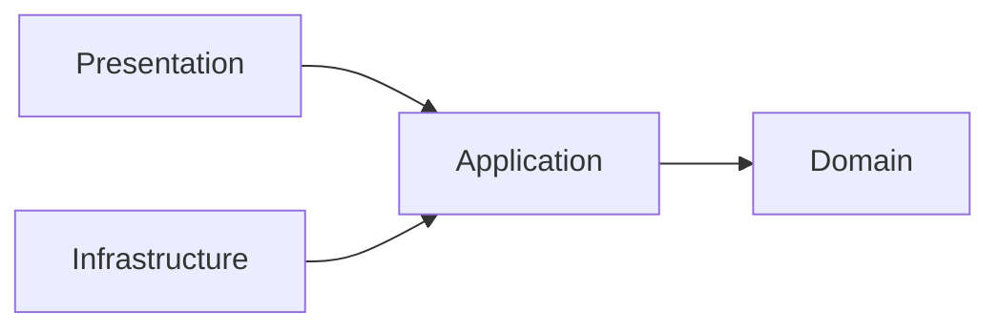
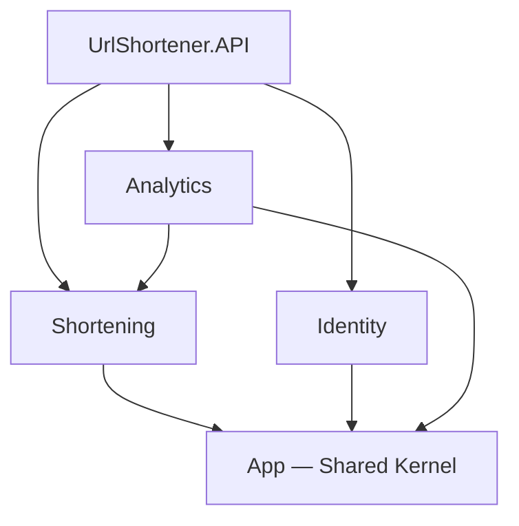
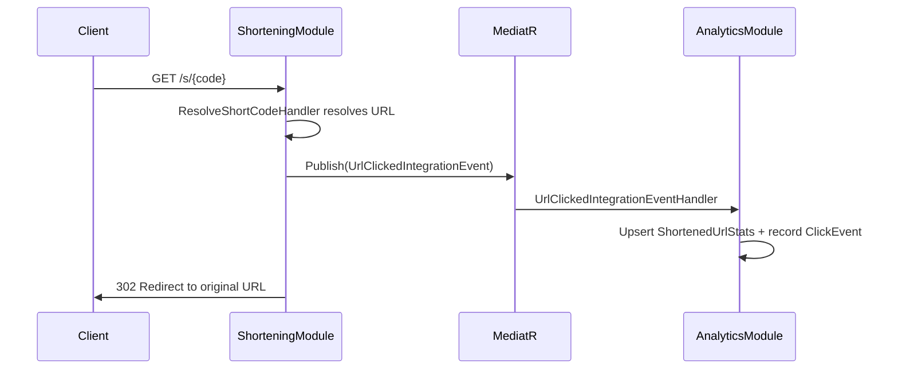
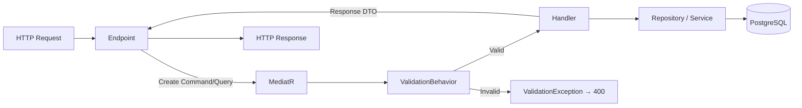

# UrlShortener — Architecture Overview

## 1. Architecture Style: Modular Monolith

The application follows a **Modular Monolith** pattern — a single deployable unit composed of independent, loosely-coupled modules. Each module is structured internally using **Clean Architecture** (Domain → Application → Infrastructure → Presentation).

```
┌──────────────────────────────────────────────────────────┐
│                   UrlShortener.API                        │
│          (Composition Root / Host / Entry Point)          │
├──────────┬──────────────────┬────────────────────────────┤
│Shortening│     Identity     │         Analytics          │
│  Module  │     Module       │          Module            │
├──────────┴──────────────────┴────────────────────────────┤
│                     App (Shared Kernel)                   │
└──────────────────────────────────────────────────────────┘
```

---

## 2. Project Structure

```
Back-end/src/
├── App/                          # Shared Kernel
│   ├── Abstractions/
│   │   ├── Entity.cs             # Base entity with domain event support
│   │   ├── IDomainEvent.cs       # Marker interface (extends MediatR INotification)
│   │   └── IIntegrationEvent.cs  # Marker interface for cross-module events
│   └── ValidationBehavior.cs     # MediatR pipeline behavior for FluentValidation
│
├── Modules/
│   ├── Shortening/               # URL shortening core
│   ├── Identity/                 # Registration, login, JWT auth
│   └── Analytics/                # Click tracking & stats
│
└── UrlShortener.API/             # ASP.NET Minimal API host
    ├── Program.cs                # Composition root
    └── ExceptionHandlers/        # Global + validation exception handlers
```

---

## 3. Module Internal Layer Structure

Every module follows the same **Clean Architecture** layout:

```
Module/
├── Domain/              Entities, Value Objects, Enums, Domain Events
│                        → Zero dependencies on external libraries
│
├── Application/         Commands, Queries, Handlers, Validators, DTOs, Contracts
│   ├── Commands/        → CQRS write operations (MediatR IRequest)
│   ├── Queries/         → CQRS read operations (MediatR IRequest)
│   ├── Contracts/       → Repository & service interfaces
│   ├── DTOs/            → Request/Response data transfer objects
│   └── IntegrationEvents/  → Events published to other modules
│
├── Infrastructure/      Persistence, External Services
│   ├── Persistence/     → DbContext, EF Core configs, Repository implementations
│   └── Services/        → Contract implementations (JWT, hashing, code generation)
│
├── Presentation/        API Endpoints (Minimal API)
│   └── *Endpoints.cs   → Maps HTTP routes to MediatR commands/queries
│
└── *Module.cs           DI composition root (extension method for IServiceCollection)
```

### Dependency Rule

Dependencies point **inward** — outer layers depend on inner layers, never the reverse:



- **Domain** has no dependencies (pure C#)
- **Application** depends on Domain, defines contracts (interfaces)
- **Infrastructure** implements the contracts defined by Application
- **Presentation** sends commands/queries through MediatR

---

## 4. Project Reference Graph



| Project | References | Why |
|---------|-----------|-----|
| **App** | *(none)* | Shared kernel — base `Entity`, `IDomainEvent`, `IIntegrationEvent`, `ValidationBehavior` |
| **Shortening** | `App` | Uses shared abstractions |
| **Identity** | `App` | Uses shared abstractions |
| **Analytics** | `App`, `Shortening` | Needs access to `UrlClickedIntegrationEvent` defined in Shortening |
| **UrlShortener.API** | All 3 modules | Composition root that wires everything together |

---

## 5. How Modules Communicate

Modules communicate exclusively through **integration events** — asynchronous, in-process notifications dispatched via MediatR's `INotification` pipeline.

### Pattern: Integration Events via MediatR



### How It Works

1. **Producer** (Shortening) defines the event in its own assembly:
   ```csharp
   // Shortening/Application/IntegrationEvents/UrlClickedIntegrationEvent.cs
   public sealed record UrlClickedIntegrationEvent : IIntegrationEvent { ... }
   ```

2. **Consumer** (Analytics) references Shortening's assembly and registers a handler:
   ```csharp
   // Analytics/Application/IntegrationEventHandlers/UrlClickedIntegrationEventHandler.cs
   public class UrlClickedIntegrationEventHandler 
       : INotificationHandler<UrlClickedIntegrationEvent> { ... }
   ```

3. **MediatR** auto-discovers all `INotificationHandler<T>` implementations at startup and dispatches events to them.

### Domain Events vs. Integration Events

| | Domain Events | Integration Events |
|---|---|---|
| **Scope** | Within a single module | Across modules |
| **Interface** | `IDomainEvent` | `IIntegrationEvent` |
| **Raised by** | `Entity.Raise()` | `IPublisher.Publish()` in handlers |
| **Example** | `UrlCreatedDomainEvent` | `UrlClickedIntegrationEvent` |
| **Purpose** | Side effects within bounded context | Notify other bounded contexts |

### Current Cross-Module Communication

```
Shortening ──UrlClickedIntegrationEvent──► Analytics
```

This is the **only** cross-module data flow. Identity is currently isolated — it will later provide `UserId` claims for authenticated endpoints.

---

## 6. Request Pipeline (CQRS)

Every HTTP request follows the same pipeline through MediatR:



1. **Endpoint** receives HTTP request, maps it to a MediatR `IRequest`
2. **ValidationBehavior** intercepts the pipeline, runs FluentValidation validators
3. **Handler** executes business logic, calls domain objects and repositories
4. **Response** flows back through the pipeline to the endpoint

---

## 7. Database Strategy

- **Single PostgreSQL instance**, shared connection string (`DefaultConnection`)
- **Schema separation** — each module uses its own DB schema to maintain logical isolation
- **Each module has its own `DbContext`**:

| Module | DbContext | Schema |
|--------|----------|--------|
| Shortening | `ShorteningDbContext` | `shortening` |
| Identity | `IdentityDbContext` | `identity` |
| Analytics | `AnalyticsDbContext` | `analytics` |

---

## 8. Module Registration & Composition Root

Each module exposes a single extension method that registers all its services:

```csharp
// Program.cs (Composition Root)
builder.Services.AddShorteningModule(builder.Configuration);  // ✅ Wired
builder.Services.AddAnalyticsModule(builder.Configuration);   // ✅ Wired
// builder.Services.AddIdentityModule(builder.Configuration); // 🔜 Not yet wired

app.MapShorteningModule();                                    // ✅ Endpoints mapped
// app.MapAnalyticsModule();                                  // 🔜 No endpoints yet
// app.MapIdentityModule();                                   // 🔜 Not yet wired
```

Each `Add*Module()` method registers:
- `DbContext` (with PostgreSQL)
- Repository implementations (scoped)
- Service implementations (singleton where stateless)
- MediatR handlers (auto-discovered from module assembly)
- FluentValidation validators (auto-discovered from module assembly)
- `ValidationBehavior<,>` as an open generic MediatR pipeline behavior

---

## 9. Error Handling

```
HTTP Request
    │
    ▼
┌─ ValidationBehavior ─┐     Catches FluentValidation failures → 400
│                       │
└───────────────────────┘
    │
    ▼
┌─ Handler ─────────────┐     Business logic exceptions
└───────────────────────┘
    │
    ▼
┌─ ValidationExceptionHandler ─┐   IExceptionHandler → 400 ProblemDetails
├─ GlobalExceptionHandler ─────┤   IExceptionHandler → 500 ProblemDetails
└──────────────────────────────┘
```

---

## 10. Technology Stack

| Layer | Technology |
|-------|-----------|
| Runtime | .NET 9 / ASP.NET Core Minimal APIs |
| CQRS / Mediator | MediatR |
| Validation | FluentValidation |
| ORM | Entity Framework Core |
| Database | PostgreSQL (via Npgsql) |
| Auth | JWT Bearer (ASP.NET Core Identity-less) |
| Password Hashing | BCrypt |
| API Docs | Swagger / Swashbuckle |
| Containerization | Docker Compose |
